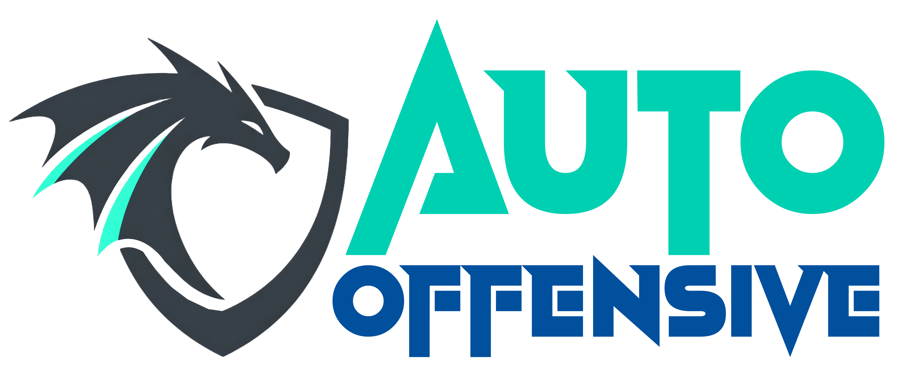
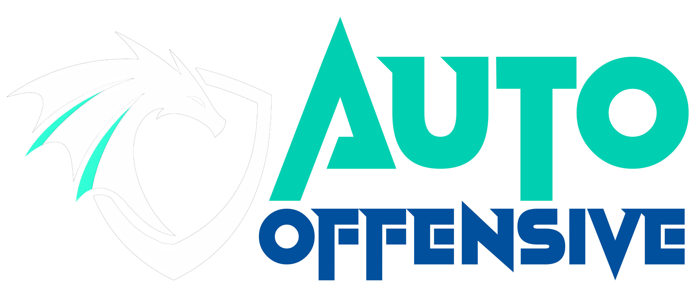
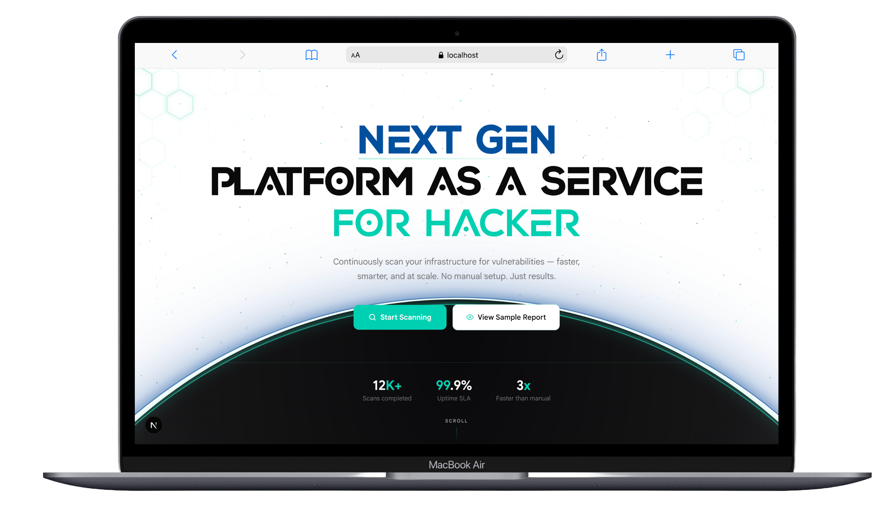
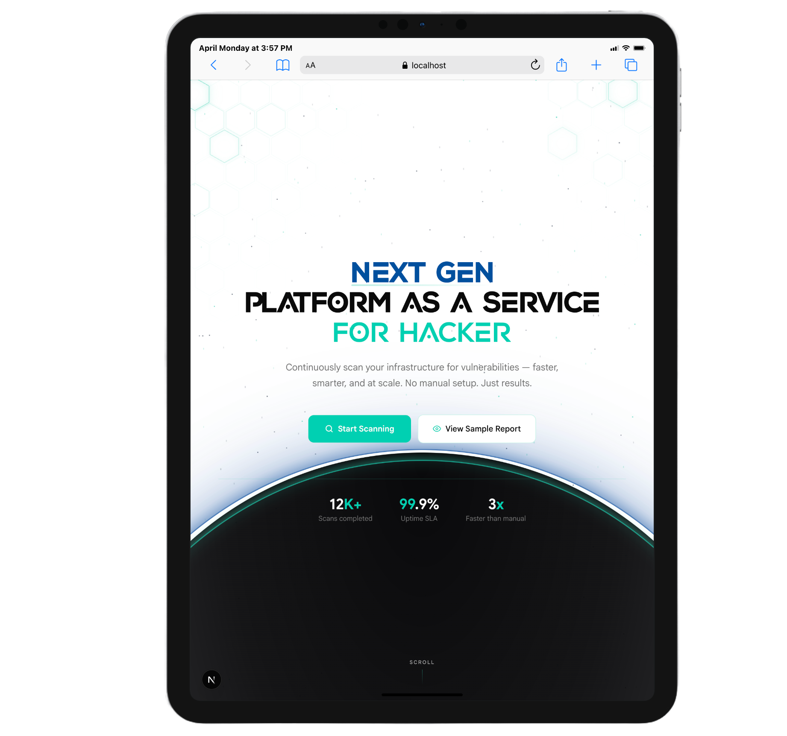
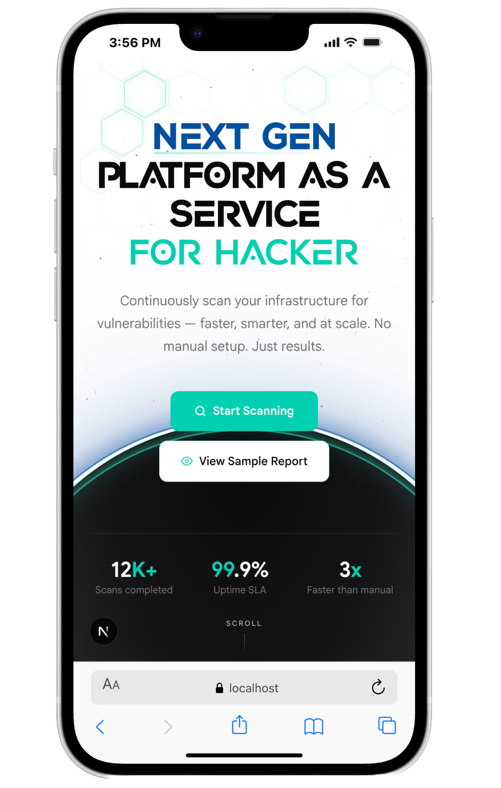

# 🚀 Auto-Offensive

<p align="center">
  
  
</p>

<p align="center">
  <strong>Automate the Attack. Secure the Stack.</strong><br/>
  A modern PaaS platform for automated penetration testing & security workflows
</p>

<p align="center">
  <a href="#"></a>
  <a href="#"></a>
  <a href="#"></a>
  <a href="#"></a>
</p>

---

## ✨ Overview

`Auto-Offensive` is a **Platform as a Service (PaaS)** that enables **automated penetration testing** through:

- 🖥️ Web Dashboard  
- 💻 CLI Interface  
- 🔗 API Integration  

No local setup. No tool configuration. Just scan.

> Designed for **security engineers, developers, and researchers** who want speed, automation, and scalability.

---

## 🖼️ Preview

<p align="center">
  
  
  
</p>

---

## ✨ Key Features

**Auto-Offensive delivers security automation across 4 core capabilities:**

### 🖥️ Automated Penetration Testing (Web UI)
- **🔍 One-Click Scanning** – Launch complex security scans directly from the dashboard with no manual configuration.
- **⚙️ Dynamic Tool Management** – Admins can add new security tools through the UI without touching backend code.
- **🔗 Tool Piping & Chaining** – Select multiple tools and pipe them together (e.g., use Nmap output as direct input for Nuclei).

### 📄 Advanced Reporting System
- **📦 Multi-Format Export** – Generate professional reports in JSON, DOCX, Excel, and PDF.
- **🔌 Portable Raw Data** – JSON output allows seamless integration into external platforms and custom dashboards.
- **🎨 Dynamic Customization** – Customize report templates and layouts directly from the UI (coming soon).

### 💻 Remote CLI Execution
- **🌐 Remote Execution** – Run scans from your local terminal without installing tools locally; the CLI calls our server-side API.
- **🔐 Cloud Synct** – Full login and authentication support to sync your sessions and history across devices.
- **⚡ Instant Results** – After a scan, the CLI returns a direct URL to view the web report or download it immediately.

### 🔒 Source Code & CI/CD Security
- **🧬 Git Integration** – Scan GitHub and GitLab repositories directly for code quality issues and hardcoded secrets.
- **🚀 Pipeline Ready** – Dedicated API endpoints for CI/CD integration to receive automated security pass/fail results.


## 🚀 Live Platform

Access our production-ready platform:

**🌐 [Auto-OffensivePlatform](https://auto-offensive.com/)**

---

## ⚙️ Getting Started

### 📥 Installation

**Clone the repository:**
```bash
git clone https://github.com/ITProfessional-Gen01/auto-offensive-frontend.git
cd auto-offensive-frontend
```

**Install dependencies:**
```bash
npm install
```

**Run the development server:**
```bash
npm run dev
```

---

## 🛠 Technology Stack

Auto-Offensive leverages a modern, high-performance stack designed for security, scalability, and real-time execution.

### 🎨 Frontend Technologies

#### **🏗️ Core Framework & Libraries**
- **⚡ Next.js (App Router)** - React-based full-stack framework with SSR, SSG, and performance optimization
- **📘 TypeScript** - Strongly typed JavaScript for enhanced reliability and developer experience

#### **🎭 Styling & UI Components**
- **🌊 Tailwind CSS** - Utility-first CSS framework for rapid, responsive design
- **🎨 CSS3** - Modern styling with animations, transitions, and responsive layouts
- **📄 HTML5** - Semantic markup for accessibility and SEO optimization
- **🧩 Shadcn/ui Components** - Modern, accessible, and customizable component library

#### **🔄 State Management & Logic**
- **🗃️ Redux** - Predictable state container for complex application state management
- **🚀 JavaScript (ES6+)** - Modern JavaScript features for enhanced functionality

### ⚙️ Backend & Security

#### **🏢 Core Framework**
- **🚀 Go (Golang):** -  High-concurrency engine used for heavy-duty scanning tasks and tool orchestration.
- **🐍 FastAPI:** - Modern, high-performance Python framework used for rapid API development and asynchronous task handling.
- **🔐 Keycloak** - Open-source identity and access management for secure authentication


### 💾 Database & Caching

#### **🗄️ Primary Database**
- **🐘 PostgreSQL** - Our primary relational database, ensuring ACID compliance and robust data integrity for user and scan records.


### 🐳 DevOps & Deployment

#### **📦 Containerization**
- **🐋 Docker** - Containerization for:
  - 📦 Application packaging and deployment
  - 🔄 Environment consistency
  - 🏗️ Microservices orchestration
  - 📈 Simplified scaling

#### **🌐 Web Server & Infrastructure**
- **🚀 NGINX** - High-performance reverse proxy for load balancing and SSL termination
- **☁️ Cloud Deployment** - Scalable cloud infrastructure
- **🔄 CI/CD Pipeline** - Automated testing, building, and deployment

---

## 🗺️ Navigation Structure

Clear and intuitive navigation across **public**, **user**, and **admin** areas ensures a seamless experience.

---

### 🌐 Public Navigation

- 🏠 **Home**  
  [https://auto-offensive.com/](#)  
  → Platform overview and introduction  

- 🛠️ **Tools**  
  [https://auto-offensive.com/tools](#)  
  → Explore automated security tools  

- ✨ **Features**  
  [https://auto-offensive.com/features](#)  
  → Discover orchestration & automation capabilities  

- 📚 **Resources**  
  [https://auto-offensive.com/kb](#)  
  → Knowledge base and security documentation  

- 🔑 **Login**  
  [https://auto-offensive.com/login](#)  
  → Access your secure dashboard  

- 📝 **Register**  
  [https://auto-offensive.com/signup](#)  
  → Create an account for full access  

---

### 🔐 Authenticated User Pages

- 📊 **Dashboard**  
  https://app.auto-offensive.com/dashboard  
  → View scan history, recent results, and quick actions  

- 🔍 **New Scan**  
  https://app.auto-offensive.com/scan  
  → Configure and launch automated security workflows  

- 📄 **Reports**  
  https://app.auto-offensive.com/reports  
  → Manage, view, and export scan results  

- ⚙️ **Profile Settings**  
  https://app.auto-offensive.com/profile  
  → Update account details and manage API keys  

---

### 🛡️ Admin Panel

- 👥 **User Management**  
  https://app.auto-offensive.com/admin/users  
  → Monitor, manage, and control user accounts  

- 🛠️ **Tool Management**  
  https://app.auto-offensive.com/admin/tools  
  → Add, update, or remove security tools dynamically  

- 📖 **Documentation Editor**  
  https://app.auto-offensive.com/admin/docs  
  → Update and manage knowledge base content in real-time  

- 📈 **Analytics Dashboard**  
  https://app.auto-offensive.com/admin/analytics  
  → Track usage metrics and platform performance  

---


## 🙏 Acknowledgments

We would like to express our deepest gratitude to our mentors:

**👨‍🏫 Mr. Kim Chansokpheng and 👨‍🏫 Mr. Sreng Chipor**

Their technical expertise and strategic guidance were the cornerstones of **Auto-Offensive**. . Beyond providing solutions, they challenged us to think critically and architect with precision. We are profoundly grateful for their patience and for the professional standards they inspired us to uphold.


**🌟 Thank you for empowering us to build with excellence.!**

---

## 💡 Our Mission

### 🔐  **"Automate the Attack. Secure the Stack."**

*Empowering security professionals, developers, and researchers with accessible, automated penetration testing tools — without the infrastructure complexity.*


---

<p align="center">
<strong>🚀 Ready to automate your security workflow?</strong>


<a href="#">🌐 Visit Auto-Offensive Today!</a>
</p># reffensive-frontend
# reffensive-frontend
